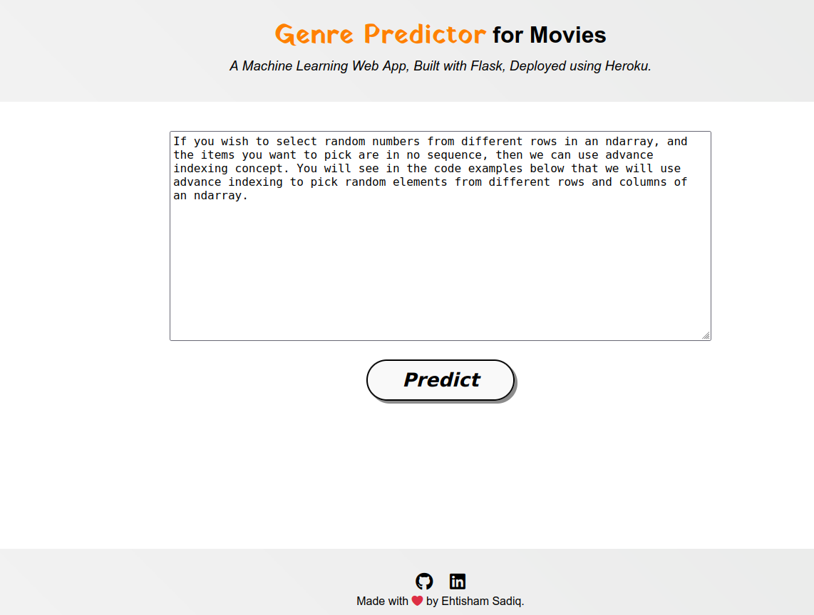

# Movie Genre Prediction - Deployment

### Key Topics Covered:

- **Data Collection and Preprocessing:** Explore the methods used to gather movie data and the steps involved in cleaning and preparing the dataset for analysis.

- **Feature Engineering:** Learn how feature selection and engineering play a crucial role in building effective genre prediction models.

- **Machine Learning Models:** Dive into the world of machine learning algorithms, from classic methods to deep learning, and understand how they are applied to predict movie genres.

- **Evaluation Metrics:** Discover the metrics used to assess the performance of genre prediction models, ensuring they meet industry standards.

- **Model Deployment:** Explore the deployment of the machine learning model into a production environment for real-world applications.

- **User Interface:** Understand how to create an intuitive user interface for users to interact with the genre prediction system.

  

• This repository consists of files required to deploy a ___Machine Learning Web App___ created with ___Flask___ on ___Heroku___ platform.

• If you want to view the deployed model, click on the following link: 
Deployed at: __

• If you are searching for __Code__, __Algorithms used__ and __Accuracy__ of the model.. you won't find it here. Click the link mentioned below for the same: 
Link: _https://github.com/bsef19m521/Movie-Genre-Prediction_

• Please do ⭐ the repository, if it helped you in anyway.

• A glimpse of the web app:

_**----- Important Note -----**_ 
• If you encounter this webapp as shown in the picture given below, it is occuring just because **free dynos for this particular month provided by Heroku have been completely used.** _You can access the webpage on 1st of the next month._ 
• Sorry for the inconvenience.

